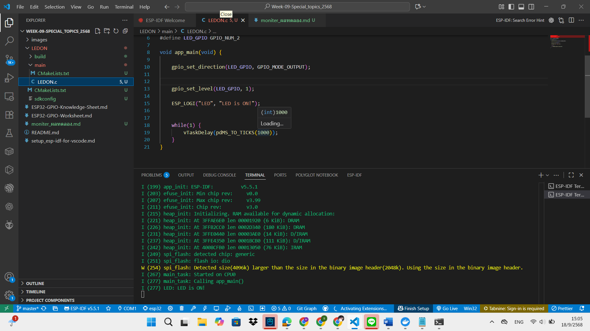

LED ติดค้างตลอด

LED ติด 3 วินาทีแล้วดับ

LED จะกระพริบทุก 1 วินาที

LED ค่อย ๆ สว่างและค่อย ๆ หรี่ลง

LED ทั้ง 3 ดวงจะติดและดับพร้อมกันทุก 1 วินาที

พิมพ์ a → LED จะวิ่งซ้าย-ขวาแบบ Knight Rider

พิมพ์ b → LED ทั้งสามจะกระพริบตามเลขฐานสองนับจาก 0 ถึง 7

พิมพ์ c → LED จะสุ่มรูปแบบการติด

พิมพ์ a → Knight Rider Breathing : LED ทั้งสามจะ “หายใจ” ไล่ไปมา (ซ้าย–ขวา–ซ้าย)

พิมพ์ b → Binary Counter Breathing : LED ทั้งสามแสดงค่าฐานสอง (000 ถึง 111) โดยค่อย ๆ ติดและดับ

พิมพ์ c → Random Breathing : จะเลือก LED แบบสุ่มและความสว่างแบบสุ่มเพื่อหายใจ
